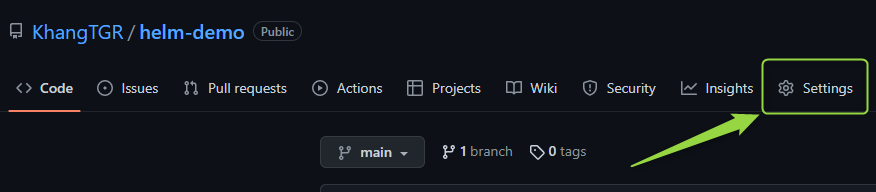
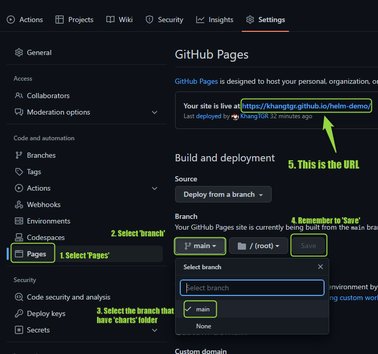

Refference: https://www.opcito.com/blogs/creating-helm-repository-using-github-pages
Source Link: https://github.com/KhangTGR/helm-demo
# Helm chart repo on GitHub instructions
## Step 1 | Prepare a 'charts' folder that contains all the chart files
In this tutorial, I chose 'hello-world' chart which I already have. 

    charts
    └── hello-world
        ├── Chart.yaml
        ├── templates
        │   ├── deployment.yaml
        │   ├── _helpers.tpl
        │   ├── hpa.yaml
        │   ├── ingress.yaml
        │   ├── NOTES.txt
        │   ├── serviceaccount.yaml
        │   ├── service.yaml
        │   └── tests
        │       └── test-connection.yaml
        └── values.yaml

This is an **optional** choice, yet make sure that the charts run without flaws. Use command:

    helm lint charts/hello-world

If it show like in the below, then it runs.

    ==> Linting charts/hello-world
    [INFO] Chart.yaml: icon is recommended

    1 chart(s) linted, 0 chart(s) failed

Next, add robots.txt at the root location of the repository. This will avoid bot crawling on the Helm repository. 

    echo -e “User-Agent: *\nDisallow: /” > robots.txt 

Finally, package the chart files to a tar. Get to the repository directory to run this command:

    helm package charts/hello-world

## Step 2 | Create an URL for GitHub repository
Follow the instructions in the pictures below:

After having the URL, create the index.yaml file for the Helm repository.

    helm repo index --url https://khangtgr.github.io/helm-demo/ . 

The 'index.yaml' would look like this:

    apiVersion: v1
    entries:
    hello-demo:
    - apiVersion: v2
        appVersion: 1.16.0
        created: "2022-12-29T16:25:58.421584905+07:00"
        description: A demo Helm chart playground for testing Chart repo on GitHub
        digest: 644d63bc95d5857890d481fdb5234234739246b9f86c54b85b840141d78e666e
        name: hello-demo
        type: application
        urls:
        - https://khangtgr.github.io/helm-demo/hello-demo-0.1.0.tgz
        version: 0.1.0
    generated: "2022-12-29T16:25:58.392451999+07:00"

Finally, **push** and **commit** everything onto repository

## Step 3 | Install the chart repo for usage
Add the repo first.

    helm add repo myrepo https://khangtgr.github.io/helm-demo/

To see the result, use these commands:

    helm repo list
    helm search repo myrepo

Ultimately, install the charts

    helm install myrelease myrepo/hello-demo 

# Have fun and good luck!